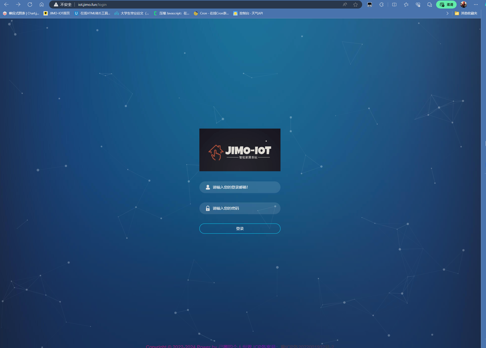
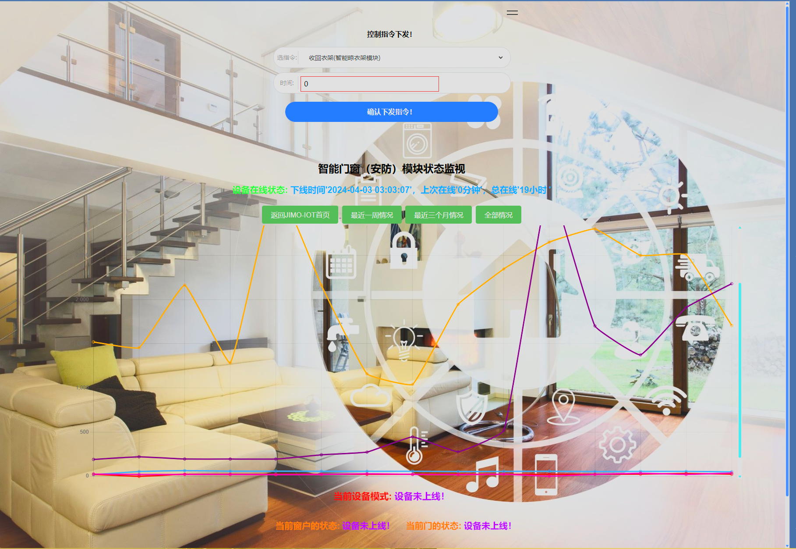
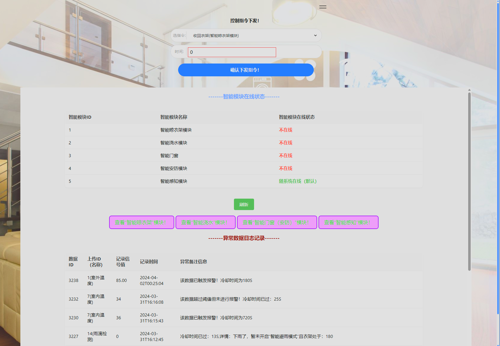
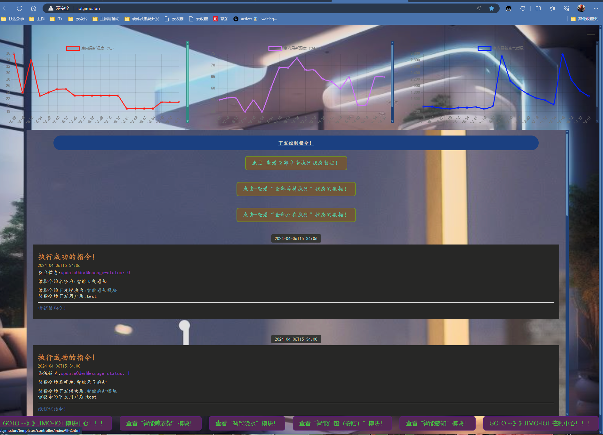

# JIMO_IOT

#### 介绍
针对物联网的控制及数据整理开发一个云系统,集成对硬件的便捷控制处理及数据的可视化展示!
通过查找无法直接用UNO的封装库对ESP进行串口的便捷互联网的直接访问，只能单独在ESP中进行ServerWeb的程序编写然后在用串口与UNO进行通信传输指令，为提升响应和处理效率以及可扩展性必须放弃AT指令的方式进行操作。我们直接进行协议自定义提高效率增强扩展的能力，具体见下边的开发设计。
我们要实现的是HTTP协议下的CloudServerController直接对ESP的通信，ESP将UNO中传感器数值对应POST请求给云端Mysql、ESP对云端PUT（update）请求的硬件模块状态修改、ESP通过GET请求直接获取相关API的信息用于UNO的控制判断。没有MQTT的中间商会减小很多延迟和简化系统复杂度。

#### 软件架构
版本1.3V[JIMO_IOT-V1.3](https://gitee.com/chenjimo/JIMO_IOT/tree/V1.3//)
版本1.0V[JIMO_IOT-V1.0](https://gitee.com/chenjimo/JIMO_IOT/tree/V1.0/)

#### 安装教程

后续给个B站视频讲解吧！

#### 使用说明

见版本里面的原开发文档！[欢迎关注我的语雀知识库](https://www.yuque.com/jimoworld)

#### 参与贡献

1.  Fork 本仓库
2.  新建 Feat_xxx 分支
3.  提交代码
4.  新建 Pull Request

#### 特技

1.  使用 Readme\_XXX.md 来支持不同的语言，例如 Readme\_en.md, Readme\_zh.md
2.  Gitee 官方博客 [blog.gitee.com](https://blog.gitee.com)
3.  你可以 [https://gitee.com/explore](https://gitee.com/explore) 这个地址来了解 Gitee 上的优秀开源项目
4.  [GVP](https://gitee.com/gvp) 全称是 Gitee 最有价值开源项目，是综合评定出的优秀开源项目
5.  Gitee 官方提供的使用手册 [https://gitee.com/help](https://gitee.com/help)
6.  Gitee 封面人物是一档用来展示 Gitee 会员风采的栏目 [https://gitee.com/gitee-stars/](https://gitee.com/gitee-stars/)
